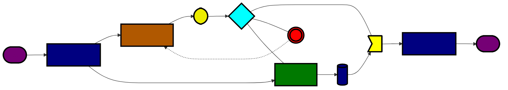

# Hexapod Gesture Control Project

  

---

## Project Progress

- [Project ToDo List](./docs/instructions/TODO.md) - This document contains the list of tasks and their status for the Hexapod Project.

- [Structure Guides](./docs/instructions/GUIDES.md) - Basic info about scope of structures

- [References](./docs/instructions/REFERENCES.md) - References support

- [Workflow](./diagrams/WORKFLOW.md) - Detailed workflow of the project.

---

## **Table of Contents**

- [Description](#description)
- [Key Features](#key-features)
- [Future Applications](#future-applications)
- [Documentation](#documentation)
- [Contribution Guide](./docs/instructions/CONTRIBUTING.md)
- [License](#license)

## **Description**

Welcome to the Hexapod Gesture Control project, developed as part of the academic curriculum at the Pontifical Catholic University of Minas Gerais (PUC Minas), in the Electronics and Telecommunication Engineering course. This project aims to create a hexapod robot that can be controlled using gesture-based inputs, leveraging motors, RF communication, and a Microcontroller Unit (MCU).

The ultimate goal of this project is to explore the potential of gesture-based control in robotics and develop a platform that can assist society in various domains, such as search and rescue operations during accidents or fires, construction activities, and more. The hexapod's versatility and mobility make it an ideal candidate for diverse real-world applications.

## **Key Features**

- **Gesture Control:** The hexapod robot will be capable of recognizing and responding to hand gestures, allowing for intuitive and natural control.
- **Robust Mechanism:** The hexapod will feature a sturdy mechanical design with six legs, ensuring stability and maneuverability across various terrains.
- **Wireless Communication:** RF communication will enable remote control of the hexapod, offering flexibility and extended range.
- **MCU Programming:** The hexapod's behavior and motion patterns will be programmed using the Microcontroller Unit (MCU).
- **Research Impact:** The project aims to pave the way for future advancements in gesture-based robotics, contributing to the field of human-robot interaction and automation.

## **Future Applications**

In the long term, this project envisions a future where gesture-controlled robots can play a vital role in different scenarios, including:

1. **Search and Rescue:** Deploying hexapods in disaster-stricken areas to locate and assist victims during rescue missions.
2. **Firefighting Support:** Using hexapods to navigate hazardous environments and support firefighting efforts.
3. **Construction Assistance:** Hexapods could aid in construction projects, carrying materials, and performing tasks in hard-to-reach areas.
4. **Agriculture and Inspection:** Hexapods can be employed for agricultural purposes and inspection tasks, such as monitoring crops or inspecting infrastructure.

We believe that gesture-controlled hexapods have the potential to revolutionize robotics and contribute positively to society. As we progress through this project, we hope to create a platform that inspires future innovations in the field of robotics and automation.

## **Documentation**

For detailed documentation and technical information, please refer to the [Documentation](./docs) folder.

## **Contribution Guide**

If you wish to contribute to the project, follow the guidelines described in the [Contribution Guide](./docs/instructions/CONTRIBUING.md).

## **License**

This project is licensed under the [MIT License](./LICENSE) - you can view the full license terms there.
