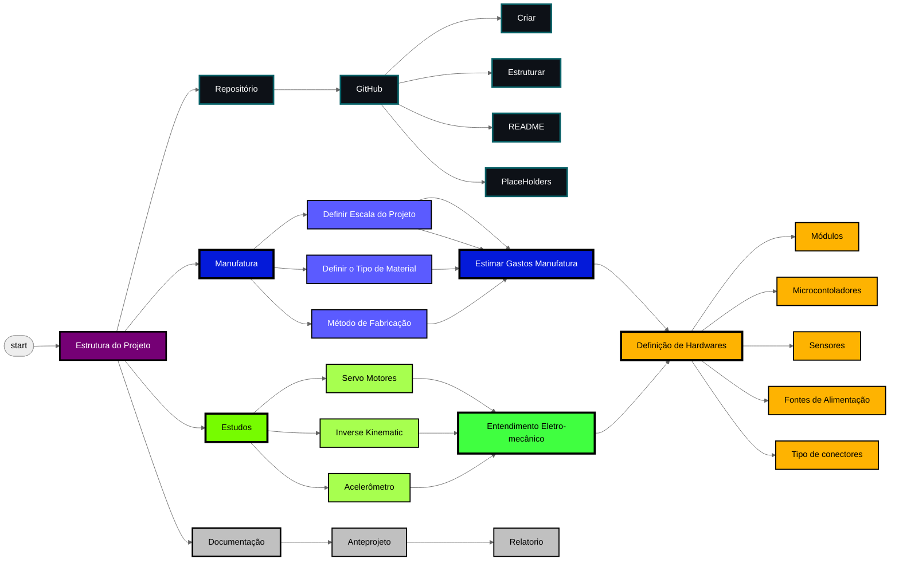

<!DOCTYPE html>
<html>
<head>
  <title>Diagrama Mermaid com Fundo Branco</title>
  
</head>
<body>
  

    

```mermaid

%%{init: {'theme': 'neutral'}}%%

flowchart LR

                    %% Estruturar o Projeto %%

start(["start"])
estrutura["Estrutura do Projeto"]
style estrutura fill:#750075,color:#ffffff,stroke-width: 3px,stroke:#000000;

start --> estrutura

                    %% Repositorio


repo["Repositório"]
style repo fill:#0d1117,color:#ffffff,stroke-width: 3px,stroke:#086167;

estrutura --> repo

github["GitHub"]
style github fill:#0d1117,color:#ffffff,stroke-width: 3px,stroke:#086167;

repo_criar["Criar"]
style repo_criar fill:#0d1117,color:#ffffff,stroke-width: 3px,stroke:#086167;

repo_estruturar["Estruturar"]
style repo_estruturar fill:#0d1117,color:#ffffff,stroke-width: 3px,stroke:#086167;

repo_readme["README"]
style repo_readme fill:#0d1117,color:#ffffff,stroke-width: 3px,stroke:#086167;

repo_pholder["PlaceHolders"]
style repo_pholder fill:#0d1117,color:#ffffff,stroke-width: 3px,stroke:#086167;

repo --> github
github --> repo_criar
github --> repo_estruturar
github --> repo_readme
github --> repo_pholder

                    %% Manufatura %%


manufatura["Manufatura"]
style manufatura fill:#041ad9,color:#ffffff,stroke-width: 4px,stroke:#000000;

estrutura --> manufatura

manufatura --> escala["Definir Escala do Projeto"]
style escala fill:#5b5bff,color:#ffffff,stroke-width: 2px,stroke:#000000;

manufatura --> tipo-material["Definir o Tipo de Material"]
style tipo-material fill:#5b5bff,color:#ffffff,stroke-width: 2px,stroke:#000000;

manufatura --> metodof["Método de Fabricação"]
style metodof fill:#5b5bff,color:#ffffff,stroke-width: 2px,stroke:#000000;


                    %% Gastos material

gastomanufatura[Estimar Gastos Manufatura]
style gastomanufatura fill:#041ad9,color:#ffffff,stroke-width: 4px,stroke:#000000;

escala --> gastomanufatura

tipo-material --> gastomanufatura

escala  --> gastomanufatura

metodof --> gastomanufatura


                    %% Estudos %%

estudos["Estudos"]
style estudos fill:#76fc00,color:#000000,stroke-width: 4px,stroke:#000000;

estrutura --> estudos

estudos --> servomotores["Servo Motores"]
style servomotores fill:#a7ff4f,color:#000000,stroke-width: 2px,stroke:#000000;

estudos --> invknematic["Inverse Kinematic"]
style invknematic fill:#a7ff4f,color:#000000,stroke-width: 2px,stroke:#000000;

estudos --> acelelometro["Acelerômetro"]
style acelelometro fill:#a7ff4f,color:#000000,stroke-width: 2px,stroke:#000000;


                    %% Entendimento eletro-mecanico

eletromecanico["Entendimento Eletro-mecânico"]
style eletromecanico fill:#40ff40,color:#000000,stroke-width: 4px,stroke:#000000;

servomotores--> eletromecanico
invknematic--> eletromecanico
acelelometro--> eletromecanico


                    %% Definição de Hardware %%


hardware["Definição de Hardwares"]
style hardware fill:#feb301,color:#000000,stroke-width: 4px,stroke:#000000;

eletromecanico --> hardware  
gastomanufatura --> hardware  

hardware -->  modulos["Módulos"] 
style modulos fill:#feb301,color:#000000,stroke-width: 2px,stroke:#000000;

hardware -->  mcu["Microcontoladores"] 
style mcu fill:#feb301,color:#000000,stroke-width: 2px,stroke:#000000;


hardware -->  sensores["Sensores"]
style sensores fill:#feb301,color:#000000,stroke-width: 2px,stroke:#000000;

hardware -->  source["Fontes de Alimentação"] 
style source fill:#feb301,color:#000000,stroke-width: 2px,stroke:#000000;

hardware -->  conectores["Tipo de conectores"] 
style conectores fill:#feb301,color:#000000,stroke-width: 2px,stroke:#000000;

                    %% Documentação


doc["Documentação"] 
estrutura --> doc
style doc fill:#c0c0c0,color:#000000,stroke-width: 3px,stroke:#000000;


doc --> ante_projeto["Anteprojeto"]
style ante_projeto fill:#c0c0c0,color:#000000,stroke-width: 2px,stroke:#000000;

ante_projeto --> relatorio["Relatorio"]
style relatorio fill:#c0c0c0,color:#000000,stroke-width: 2px,stroke:#000000;


```

   

  

  
</body>
</html>